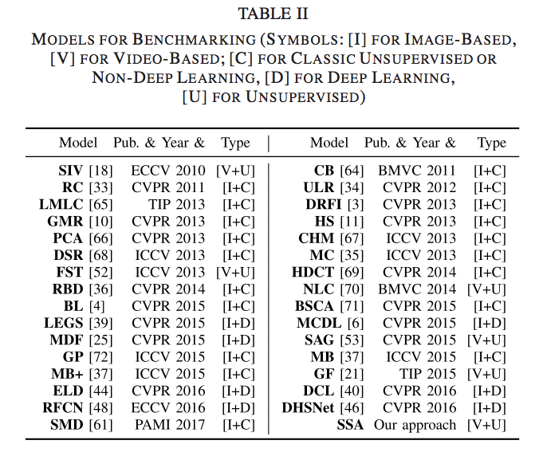
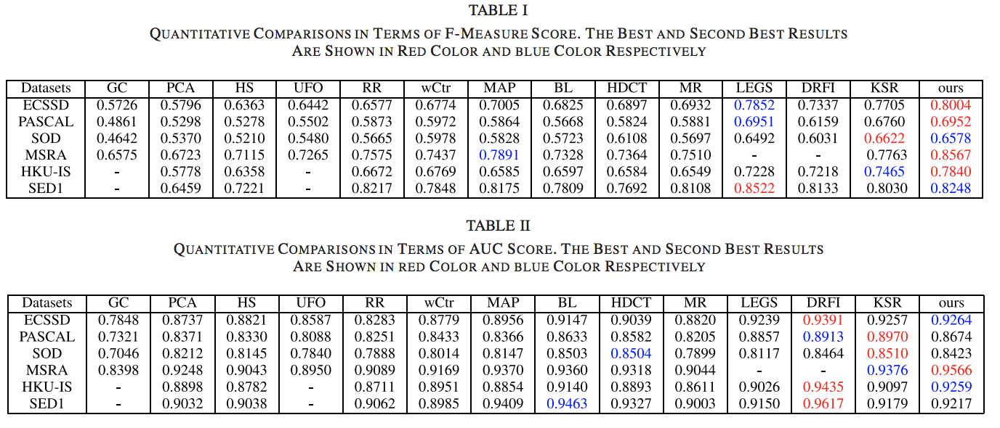
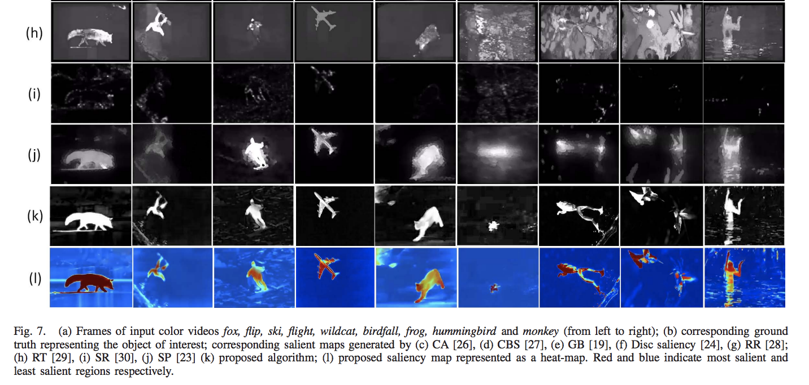
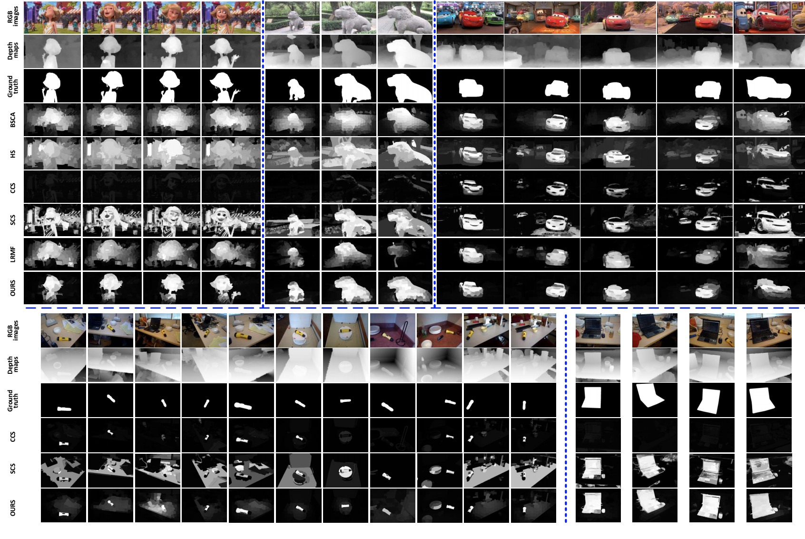
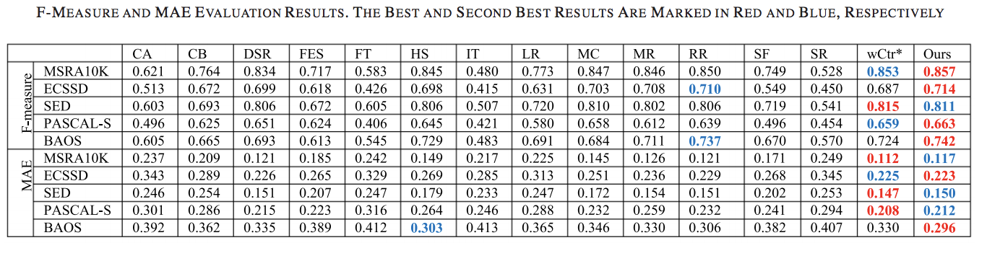
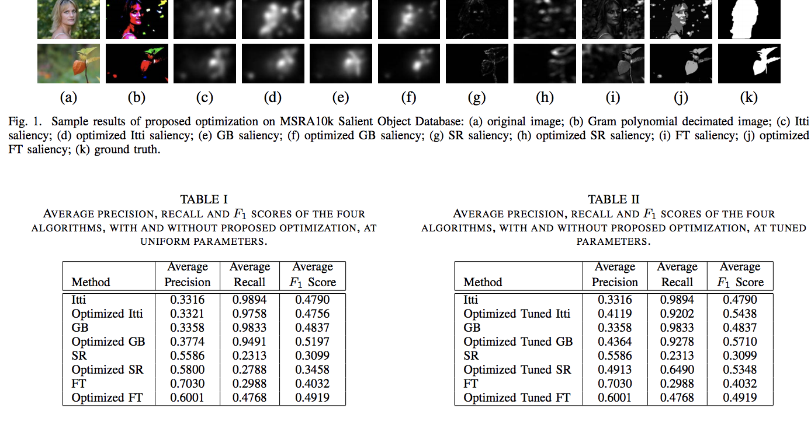
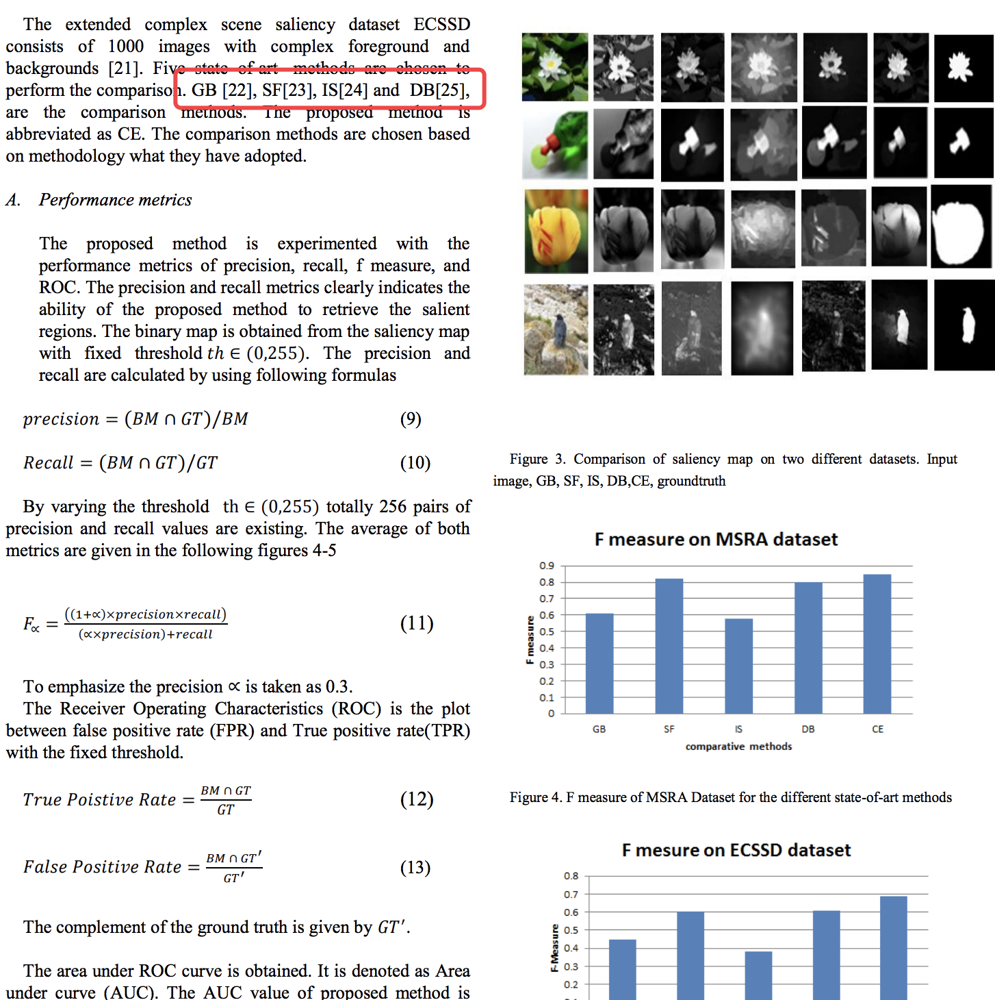
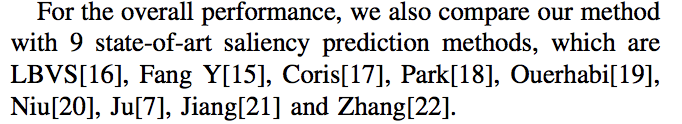

Saliency detection based on traditional method since 2017

## Conclusion
Here goes the conclusion first:  
Since browsing the paper published on the journel or conference since 2017, we found that almost all the saliency method, which based on a traditional way, are only compared with the similar traditional way and almost no deep-learning methods are included in the experiment. 

And there are some example listed below. (They are the newest paper searched in IEEE.Xplore with the keyword-saliency.)

## Examples
### Paper on <i>TIP (IEEE. Trans on Image Processing)</i>, 2018
['A Benchmark Dataset and Saliency-Guided Stacked
Autoencoders for Video-Based Salient
Object Detection'](http://ieeexplore.ieee.org/stamp/stamp.jsp?tp=&arnumber=8066351) is the only one paper that I found in the IEEE.Xplore that compared there proposed method (not deep-learning way) with the deep learning method and gain the very outstanding performance. The proposal they compared is listed as below:

The paper ['Saliency Detection Based on Multiscale Extrema
of Local Perceptual Color Differences'](http://ieeexplore.ieee.org/stamp/stamp.jsp?tp=&arnumber=8086189) is published on <i>TIP</i>, Feb, 2018. And in experiment part, the compared with the traditional method before 2016.

The experiment part of the paper ['Saliency Detection via Absorbing Markov Chain
With Learnt Transition Probability'](http://ieeexplore.ieee.org/stamp/stamp.jsp?tp=&arnumber=8085143) still don't include the deep-learning method.

This paper ['Visual Saliency Detection Using
Spatiotemporal Decomposition'](http://ieeexplore.ieee.org/stamp/stamp.jsp?tp=&arnumber=8170237) proposed an spatiotemporal decomposition method to detect the saliency in videos. However, there isn't depth information in videos. In the experiments, still compared with all traditional way.

In the paper ['Co-Saliency Detection for RGBD Images Based on
Multi-Constraint Feature Matching and
Cross Label Propagation'](http://ieeexplore.ieee.org/stamp/stamp.jsp?tp=&arnumber=8070326), the compared with the state-of-the-art methods: HS, BSCA, RC, DRFI, ACSD, DCMC, CCS, SCS, and LRMF. No deep-learning way being compared.

In the paper ['Reversion Correction and Regularized Random
Walk Ranking for Saliency Detection'](http://ieeexplore.ieee.org/stamp/stamp.jsp?tp=&arnumber=8066382), one result of experiment part follows (no deep learning way included):

['Unsupervised Uncertainty Estimation Using
Spatiotemporal Cues in Video Saliency Detection'](http://ieeexplore.ieee.org/stamp/stamp.jsp?tp=&arnumber=8307422), this paper first submiited in December 9, 2016 and then accepted Feb. 20, 2018, in <i>IEEE. Trans on Image Processing</i>. The proposal is compared with none-deep-learning method.

### Paper on Other Journel or Conference

In paper ['Detecting video saliency via local motion estimation'](http://ieeexplore.ieee.org/stamp/stamp.jsp?tp=&arnumber=8313675), which is published in ICIIP 2017, only compared there result with other four proposal such as 'GVS'.

The proposal in paper ['Optimization of Bottom-up Saliency Detection
through Gram Polynomial Decimation'](http://ieeexplore.ieee.org/stamp/stamp.jsp?tp=&arnumber=8312244), which is published on (2018) 15th International Bhurban Conference on Applied Sciences and Technology (IBCAST), are not compared there traditional method with deep learning way.

In paper ['CONTRAST ENHANCEMENT SCHEME FOR
VISUAL SALIENCY DETECTION'](http://ieeexplore.ieee.org/stamp/stamp.jsp?tp=&arnumber=8305811), the author use superpixel to segment the image and then based on color channel, the contrast is caculated to generate the saliency area. However, they still compared their proposal with the traditional way and no deep-learning way are compared. This paper is published on <i>International Conference on Signal Processing and Communication (ICSPC’17)</i> on $28^{th}$ July, 2017.

In another paper published on the same conference mentioned in the last paragaraph, the author proposed a saliency-seed-growing method. And in the experiment, the compared with the proposals shown in the following picture, which are all traditional method.

The paper ['A robust 3D visual saliency computation model for human fixation prediction of stereoscopic videos'](http://ieeexplore.ieee.org/stamp/stamp.jsp?tp=&arnumber=8305060) was published on Visual Communications and Image Processing (VCIP), 2017 IEEE. And no deep-learning way are compared with the proposal.

